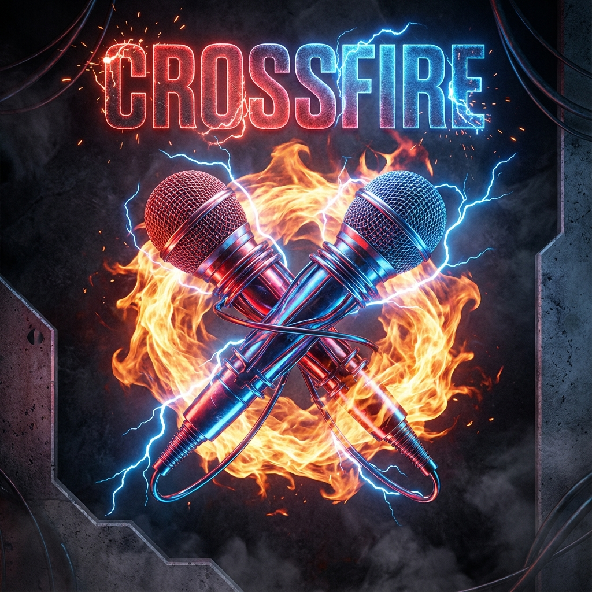

# CROSSFIRE PODCAST: AI-Generated Debates 🎙️🔥

> **A Next-Gen AI Podcast Platform capable of generating hyper-realistic, aggressive debates on ANY topic.**



## Overview
**CROSSFIRE** is an autonomous content generation engine. Give it a topic (e.g., *"Vim vs Emacs"* or *"India's Space Policy"*), and it will:
1.  **Cast Experts**: Dynamically generate 5 unique AI personas (Traditionalist, Reformist, Technocrat, etc.).
2.  **Script a Debate**: Write a high-stakes, spoken-word style script using **Gemini 2.0 Flash**.
3.  **Synthesize Audio**: Generate broadcast-quality voices using **Google Cloud TTS**.
4.  **Visualize**: Play the episode in a futuristic **"Video Podcast" UI** with reacting avatars.

## Quick Start

### 1. Backend (Python/FastAPI)
```bash
cd backend
source venv/bin/activate
# Ensure GCP Auth
gcloud auth application-default login
# Run Server
uvicorn backend.main:app --reload
```

### 2. Frontend (Next.js)
```bash
# In root directory
npm run dev
```

Visit `http://localhost:3000` to start creating.

## Documentation
- 📐 [System Architecture](docs/ARCHITECTURE.md)
- ⚙️ [Setup Guide](docs/SETUP.md)
- 🔌 [API Reference](docs/API_REFERENCE.md)
- 🤖 [AI Orchestration Deep Dive](docs/AI_ORCHESTRATION.md) ⭐ **Technical**
- 📋 [Product Requirements (PRD)](docs/PRD.md)
- 💼 [Business Plan](docs/BUSINESS.md)

## Key Features
- **Universal Personas**: The "Sovereignist" or "Reformist" archetypes adapt to *any* domain.
- **Batch Processing**: Generates the entire episode upfront for seamless playback.
- **Glassmorphism UI**: A premium, "Newsroom" aesthetic.
- **Google Cloud Integration**: Native use of Vertex AI and Cloud Storage.
