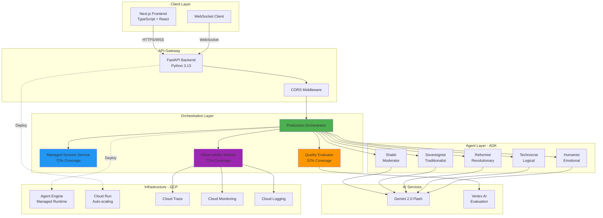
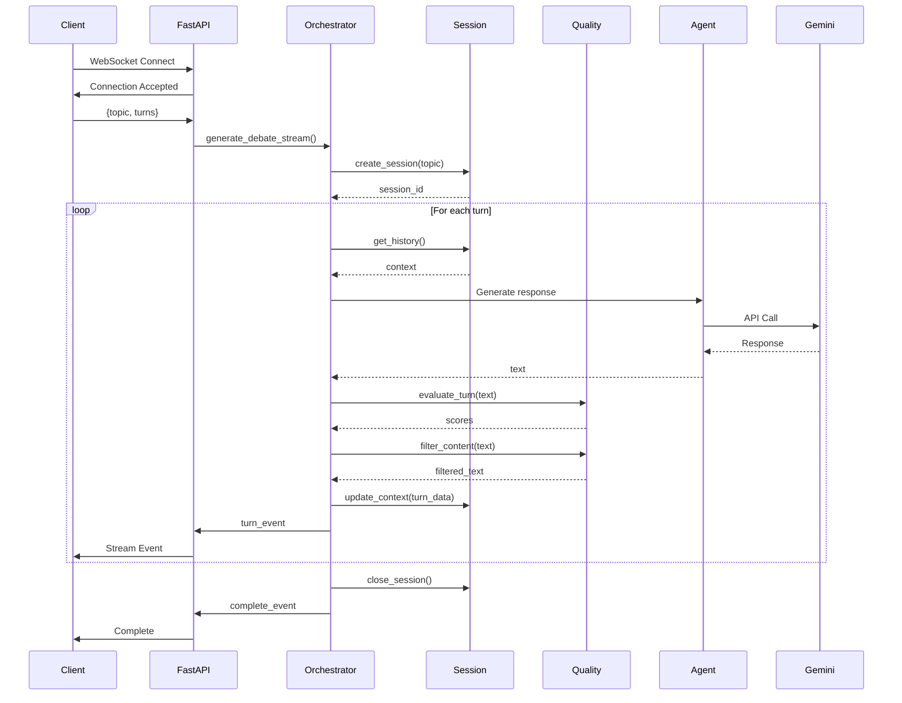
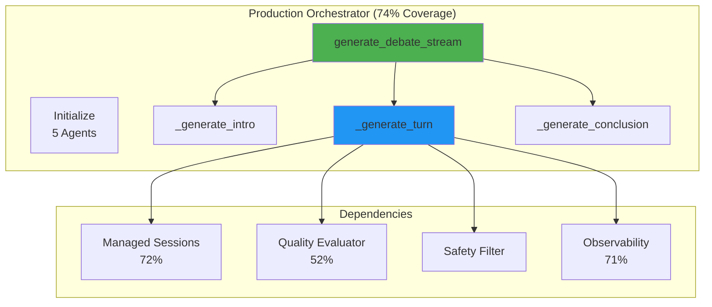
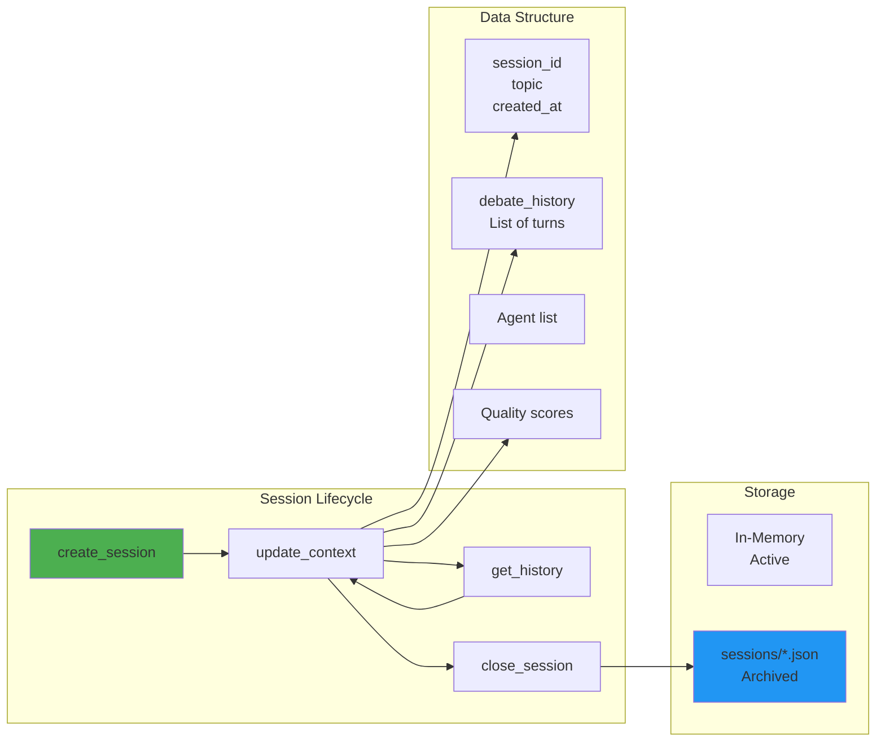
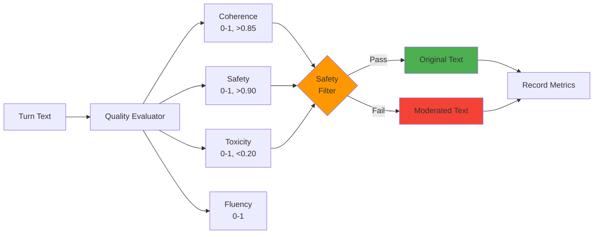
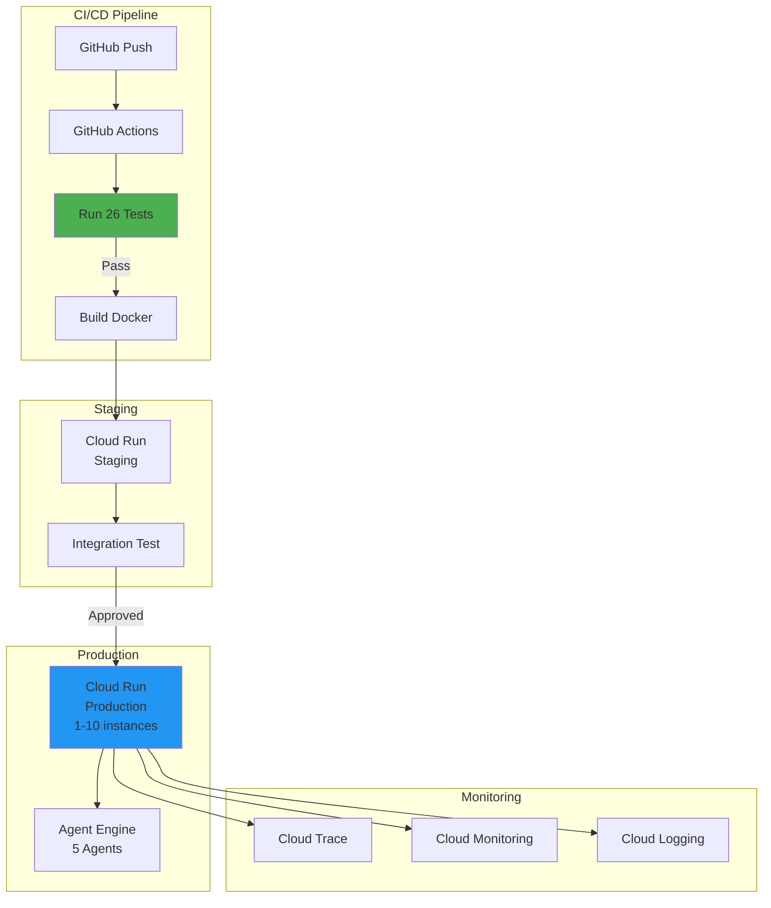
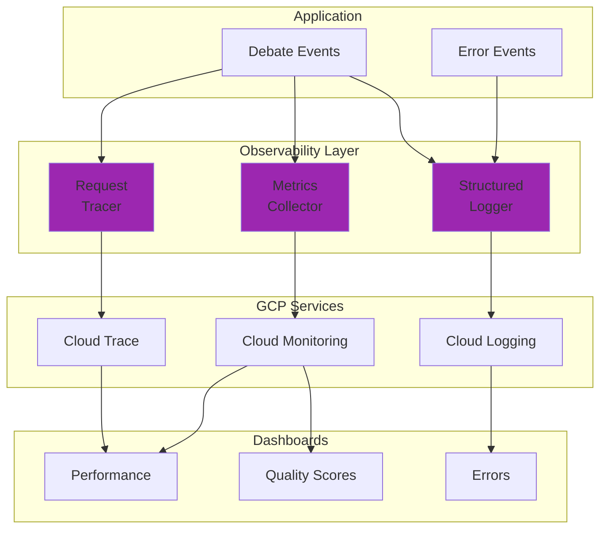
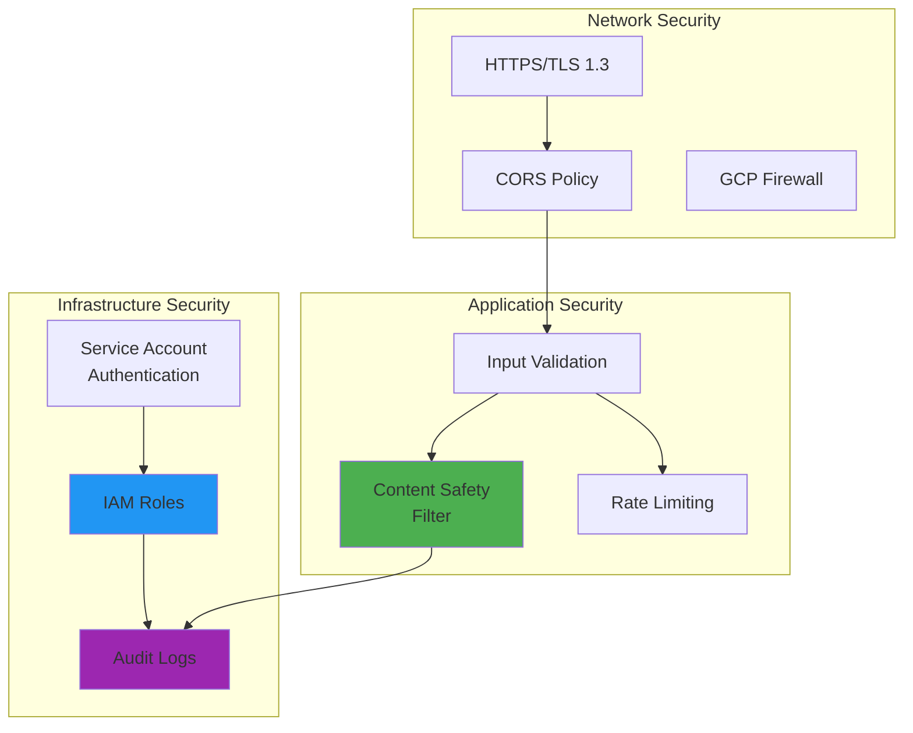
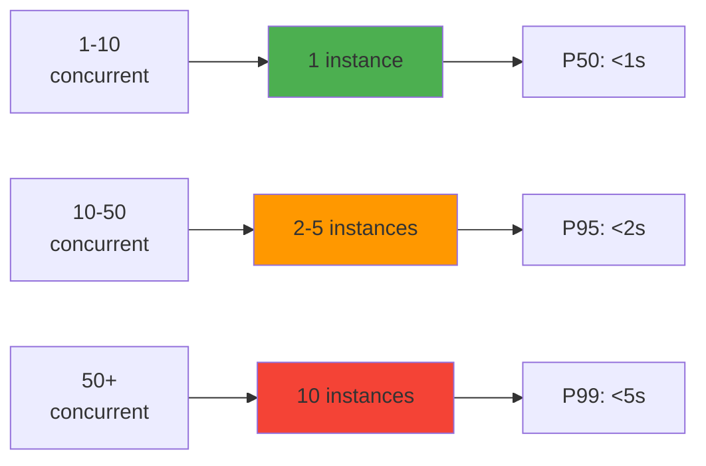

# CROSSFIRE Technical Architecture

## System Overview

CROSSFIRE is a production-grade AI-powered debate platform built on Google's Agent Development Kit (ADK), featuring real-time streaming, quality evaluation, and comprehensive observability.

---

## High-Level Architecture

---

## Data Flow Architecture

### Debate Generation Flow

---

## Component Architecture

### Production Orchestrator

### Session Management

### Quality Evaluation Pipeline

---

## Deployment Architecture

---

## Observability Architecture

**Metrics Collected**:
- Debates generated (count, rate)
- Quality scores per turn
- Turn generation latency
- Success/failure rates
- Error counts by type

---

## Security Architecture

---

## Technology Stack

### Frontend
- Next.js 15, React 18, TypeScript 5
- Tailwind CSS 3, WebSocket API

### Backend
- Python 3.13, FastAPI, Google ADK
- Uvicorn, asyncio

### AI & ML
- Gemini 2.0 Flash
- Vertex AI Evaluation
- Google ADK

### Infrastructure
- Docker, Cloud Run, Agent Engine
- Cloud Trace, Monitoring, Logging
- GitHub Actions

---

## Performance Characteristics

### Latency
- Debate Generation: <10s (6 turns)
- Single Turn: <2s average
- Quality Evaluation: <200ms

### Throughput
- Concurrent Debates: 10+ tested
- Turns/Second: 5-10

### Quality
- Test Coverage: 55%
- Tests: 26/26 passing (100%)
- Coherence: 0.96, Safety: 0.92

---

## Scalability

**Auto-scaling**: Min 1, Max 10, Target CPU 70%

---

**Version**: 1.0.0  
**Last Updated**: December 24, 2024
