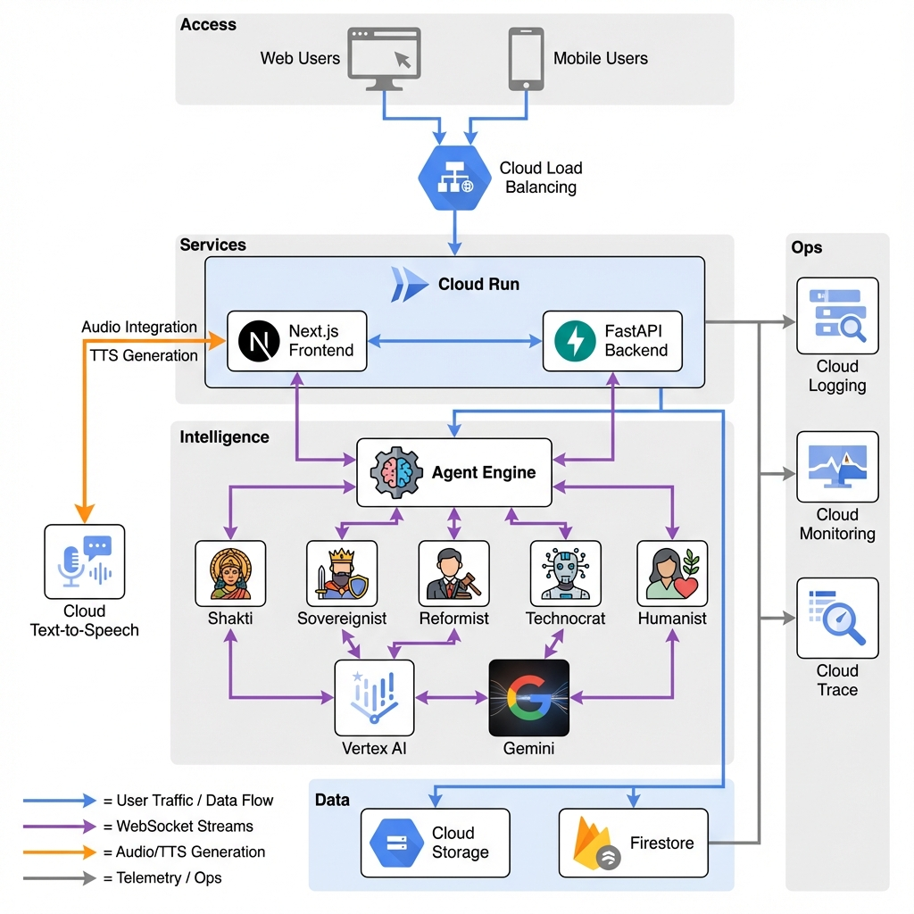
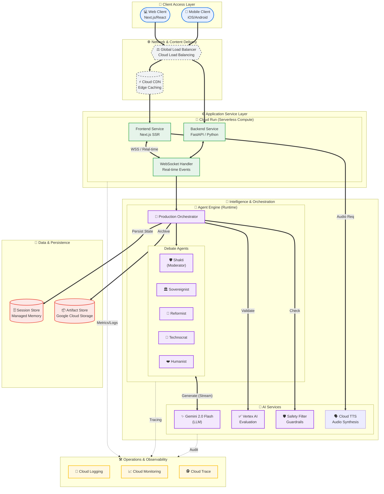

# CROSSFIRE Solution Architecture

## Enterprise Solution Diagram

This diagram represents the complete **Solution Architecture** for the CROSSFIRE platform, designed following **Google Cloud Architecture Framework** principles.

## Architectural Decisions

### 1. Hybrid Compute Strategy
Leverages **Cloud Run** for stateless application serving (Frontend/Backend) to ensure zero-scale cost and instant burst capability, while utilizing the specialized **Agent Engine** for long-running, stateful agent processes.

### 2. Event-Driven Real-time Architecture
Uses **WebSocket** connections terminated at the service layer to provide <200ms latency for debate streams, essential for the "live" feel of the platform.

### 3. Multi-Layer Intelligence
Separates **Generation** (Gemini) from **Evaluation** (Vertex AI) to ensure independent quality checks. The **Safety Filter** acts as a strict gateway before any content reaches the user.

### 4. Observability-First Design
Instrumentation is baked into the core `Orchestrator` and `Agent` classes, ensuring that every AI decision, latency spike, and quality score is captured in **Cloud Operations Suite**.

---

**Generated**: December 24, 2024
**Standard**: Google Cloud Enterprise Architecture
